# 📐 Bookstore Application - Complete Architecture Documentation

## Table of Contents
1. [Project Overview](#project-overview)
2. [System Architecture](#system-architecture)
3. [Technology Stack](#technology-stack)
4. [Directory Structure](#directory-structure)
5. [Component Details](#component-details)
6. [File-by-File Explanation](#file-by-file-explanation)
7. [Data Flow](#data-flow)
8. [Deployment Architecture](#deployment-architecture)
9. [Security Implementation](#security-implementation)
10. [DevOps Pipeline](#devops-pipeline)

---

## Project Overview

This is an **enterprise-grade 4-tier bookstore inventory management application** designed to demonstrate **DevSecOps best practices** on **OpenShift 4.18**. The project implements a complete CI/CD pipeline with security scanning, multi-environment deployment, and production-ready configurations.

### Key Features
- **Full CRUD Operations** for book inventory management
- **4-Tier Architecture**: Frontend → Backend → Cache → Database
- **Redis Caching** for improved performance
- **Security Scanning** with Trivy (CVE detection, SBOM generation)
- **Multi-Environment Support** (Dev/Prod) using Kustomize
- **Auto-scaling** with Horizontal Pod Autoscaler (HPA)
- **High Availability** with Pod Disruption Budgets (PDB)
- **Network Security** with Network Policies
- **Observability** with structured logging and Prometheus metrics

---

## System Architecture

### High-Level Architecture

```mermaid
graph TB
    subgraph "External Access"
        User[👤 User/Browser]
    end
    
    subgraph "OpenShift Cluster"
        Route[🌐 OpenShift Route<br/>TLS Termination]
        
        subgraph "Application Tier"
            Frontend[📱 Frontend<br/>Nginx<br/>Port: 8080]
            Backend[⚙️ Backend<br/>Node.js/Express<br/>Port: 3000]
        end
        
        subgraph "Data Tier"
            Redis[(🔴 Redis Cache<br/>Port: 6379)]
            MySQL[(🗄️ MySQL 8.0<br/>Port: 3306)]
        end
        
        subgraph "Storage"
            PVC[💾 Persistent Volume<br/>10Gi]
        end
        
        subgraph "Security & Scaling"
            NP[🔒 Network Policies]
            HPA[📊 Horizontal Pod Autoscaler]
            PDB[🛡️ Pod Disruption Budget]
        end
    end
    
    User -->|HTTPS| Route
    Route -->|HTTP| Frontend
    Frontend -->|API Calls| Backend
    Backend -->|Cache Check| Redis
    Backend -->|DB Queries| MySQL
    MySQL -->|Data Storage| PVC
    
    NP -.->|Controls| Frontend
    NP -.->|Controls| Backend
    HPA -.->|Scales| Backend
    PDB -.->|Protects| Backend
```



### Request Flow Diagram

```mermaid
sequenceDiagram
    participant U as User
    participant R as Route (TLS)
    participant F as Frontend (Nginx)
    participant B as Backend (Node.js)
    participant C as Redis Cache
    participant D as MySQL Database
    
    U->>R: HTTPS Request
    R->>F: HTTP Request
    F->>F: Serve Static HTML/CSS/JS
    F->>U: Return Web Page
    
    U->>F: API Request (via JS)
    F->>B: Forward to /api/*
    
    B->>C: Check Cache
    alt Cache Hit
        C-->>B: Return Cached Data
        B-->>F: Return Response
    else Cache Miss
        B->>D: Query Database
        D-->>B: Return Data
        B->>C: Store in Cache (TTL: 300s)
        B-->>F: Return Response
    end
    
    F-->>U: Display Data
```



---

## Technology Stack

### Frontend Layer
| Technology | Version | Purpose |
|------------|---------|---------|
| **Nginx** | 1.25-alpine | Static file serving, reverse proxy |
| **HTML5** | - | User interface structure |
| **CSS3** | - | Styling and responsive design |
| **Vanilla JavaScript** | ES6+ | Client-side logic and API interaction |

### Backend Layer
| Technology | Version | Purpose |
|------------|---------|---------|
| **Node.js** | 18.x | Runtime environment |
| **Express** | 4.18.2 | Web framework |
| **mysql2** | 3.6.5 | MySQL database driver |
| **redis** | 4.6.12 | Redis client |
| **helmet** | 7.1.0 | Security headers |
| **winston** | 3.11.0 | Structured logging |
| **swagger-jsdoc** | 6.2.8 | API documentation |
| **prom-client** | 15.1.0 | Prometheus metrics |

### Data Layer
| Technology | Version | Purpose |
|------------|---------|---------|
| **MySQL** | 8.0 | Primary database |
| **Redis** | 7.0 | Caching layer |

### DevOps & Security
| Tool | Version | Purpose |
|------|---------|---------|
| **Podman** | 4.0+ | Container runtime |
| **Trivy** | 0.45+ | Security scanning |
| **Kustomize** | Built-in | Configuration management |
| **OpenShift** | 4.18 | Container orchestration |

---

## Directory Structure

```
bookstore-project/
├── 📄 README.md                          # Main project documentation
│
├── 🎨 frontend/                          # Frontend application
│   ├── Dockerfile                        # Production multi-stage build
│   ├── Dockerfile.dev                    # Development build
│   ├── nginx.conf                        # Nginx configuration
│   └── html/
│       ├── index.html                    # Main HTML page
│       ├── style.css                     # Styling
│       └── app.js                        # JavaScript logic
│
├── ⚙️ backend/                           # Backend API
│   ├── Dockerfile                        # Production multi-stage build
│   ├── Dockerfile.dev                    # Development build
│   ├── package.json                      # Node.js dependencies
│   ├── package-lock.json                 # Locked dependency versions
│   └── server.js                         # Main application server
│
├── 🗄️ database/                          # Database initialization
│   ├── Dockerfile                        # MySQL custom image
│   └── init.sql                          # Database schema & seed data
│
├── ☸️ openshift/                         # Kubernetes/OpenShift configs
│   ├── base/                             # Base configurations
│   │   ├── kustomization.yaml            # Base kustomize config
│   │   ├── namespace.yaml                # Namespace definition
│   │   ├── secret.yaml                   # Database credentials
│   │   ├── pvc.yaml                      # Persistent volume claim
│   │   ├── services.yaml                 # All service definitions
│   │   ├── mysql-deployment.yaml         # MySQL deployment
│   │   ├── redis-deployment.yaml         # Redis deployment
│   │   ├── backend-deployment.yaml       # Backend deployment
│   │   ├── frontend-deployment.yaml      # Frontend deployment
│   │   └── route.yaml                    # OpenShift route (ingress)
│   │
│   ├── overlays/                         # Environment-specific configs
│   │   ├── dev/                          # Development environment
│   │   │   ├── kustomization.yaml        # Dev kustomize config
│   │   │   ├── replicas-patch.yaml       # Dev replica counts
│   │   │   └── resources-patch.yaml      # Dev resource limits
│   │   └── prod/                         # Production environment
│   │       ├── kustomization.yaml        # Prod kustomize config
│   │       ├── replicas-patch.yaml       # Prod replica counts
│   │       └── resources-patch.yaml      # Prod resource limits
│   │
│   ├── security/                         # Security configurations
│   │   ├── kustomization.yaml            # Security kustomize config
│   │   ├── network-policies.yaml         # Network isolation rules
│   │   └── pod-security.yaml             # Pod security standards
│   │
│   ├── autoscaling/                      # Scaling configurations
│   │   ├── kustomization.yaml            # Autoscaling kustomize config
│   │   ├── hpa.yaml                      # Horizontal Pod Autoscaler
│   │   └── pdb.yaml                      # Pod Disruption Budget
│   │
│   └── admin/                            # Admin-level resources
│       ├── kustomization.yaml            # Admin kustomize config
│       └── resource-quota.yaml           # Namespace resource quotas
│
├── 🔧 scripts/                           # Automation scripts
│   ├── check-prerequisites.sh            # Verify required tools
│   ├── build-images.sh                   # Build all container images
│   ├── scan-images.sh                    # Run Trivy security scans
│   ├── run-local.sh                      # Run locally with Podman
│   ├── deploy-openshift.sh               # Deploy to OpenShift
│   ├── build-on-openshift.sh             # Build images on OpenShift
│   ├── push-to-openshift.sh              # Push images to registry
│   ├── validate-security.sh              # Validate security configs
│   ├── apply-admin-resources.sh          # Apply admin resources
│   ├── cleanup.sh                        # Clean up resources
│   └── podman-compose.yml                # Local development compose
│
├── 🔒 security/                          # Security configurations
│   └── trivy-config.yaml                 # Trivy scanner config
│
├── 📊 reports/                           # Generated reports
│   └── SBOM/                             # Software Bill of Materials
│       ├── backend.json                  # Backend SBOM
│       ├── frontend.json                 # Frontend SBOM
│       └── database.json                 # Database SBOM
│
└── 📚 docs/                              # Documentation
    ├── API.md                            # API documentation
    ├── DEPLOYMENT_GUIDE.md               # Deployment instructions
    ├── SECURITY.md                       # Security documentation
    └── PROJECT_ARCHITECTURE.md           # This file
```

---

## Component Details

### 1. Frontend Component (Nginx)

**Purpose**: Serves the static web interface and acts as a reverse proxy to the backend API.

**Key Features**:
- Static HTML/CSS/JS serving
- Reverse proxy for `/api/*` requests to backend
- Security headers (CSP, X-Frame-Options, etc.)
- Gzip compression
- Non-root user execution

**Configuration Files**:
- `nginx.conf`: Main Nginx configuration with security hardening
- `index.html`: Single-page application interface
- `app.js`: Client-side JavaScript for API interaction
- `style.css`: Responsive styling

### 2. Backend Component (Node.js/Express)

**Purpose**: RESTful API server handling business logic, database operations, and caching.

**Key Features**:
- **CRUD Operations**: Full Create, Read, Update, Delete for books
- **Redis Caching**: Automatic caching with 300s TTL
- **Input Validation**: ISBN format, price range, stock validation
- **Structured Logging**: JSON logs with correlation IDs
- **Health Checks**: `/api/health`, `/api/ready` endpoints
- **Metrics**: Prometheus metrics at `/api/metrics`
- **API Documentation**: Swagger UI at `/api/docs`
- **Security**: Helmet middleware, CORS, error handling

**API Endpoints**:
| Method | Endpoint | Description |
|--------|----------|-------------|
| GET | `/api/health` | Liveness probe |
| GET | `/api/ready` | Readiness probe (checks DB/Redis) |
| GET | `/api/metrics` | Prometheus metrics |
| GET | `/api/books` | Get all books (cached) |
| GET | `/api/books/:id` | Get book by ID (cached) |
| POST | `/api/books` | Create new book |
| PUT | `/api/books/:id` | Update book |
| DELETE | `/api/books/:id` | Delete book |
| GET | `/api/docs` | Swagger API documentation |

### 3. Cache Component (Redis)

**Purpose**: In-memory caching layer to reduce database load and improve response times.

**Key Features**:
- **Cache Strategy**: Cache-aside pattern
- **TTL**: 300 seconds (5 minutes) default
- **Cache Keys**: 
  - `books:all` - All books list
  - `books:{id}` - Individual book data
- **Cache Invalidation**: Automatic on create/update/delete operations

### 4. Database Component (MySQL 8.0)

**Purpose**: Persistent data storage for book inventory.

**Schema**:
```sql
books (
  id INT PRIMARY KEY AUTO_INCREMENT,
  title VARCHAR(255) NOT NULL,
  author VARCHAR(255) NOT NULL,
  isbn VARCHAR(20) UNIQUE NOT NULL,
  price DECIMAL(10,2) DEFAULT 0.00,
  stock INT DEFAULT 0,
  created_at TIMESTAMP DEFAULT CURRENT_TIMESTAMP,
  updated_at TIMESTAMP DEFAULT CURRENT_TIMESTAMP ON UPDATE CURRENT_TIMESTAMP,
  INDEX idx_title (title),
  INDEX idx_author (author),
  INDEX idx_isbn (isbn)
)
```

**Key Features**:
- Automatic initialization with `init.sql`
- Sample data pre-loaded (8 books)
- Persistent storage using PVC
- Indexed columns for performance

---

## File-by-File Explanation

### Frontend Files

#### `frontend/Dockerfile`
**Purpose**: Multi-stage production build for frontend container.

**Key Sections**:
1. **Build Stage**: Prepares static files
2. **Runtime Stage**: Nginx Alpine image (minimal size)
3. **Security**: Runs as non-root user (nginx:nginx)
4. **Configuration**: Copies custom nginx.conf

#### `frontend/Dockerfile.dev`
**Purpose**: Development build with live reload capabilities.

#### `frontend/nginx.conf`
**Purpose**: Nginx server configuration.

**Key Configurations**:
- Listen on port 8080 (non-privileged)
- Serve static files from `/usr/share/nginx/html`
- Reverse proxy `/api/*` to backend service
- Security headers (X-Frame-Options, CSP, etc.)
- Gzip compression enabled
- Access and error logging

#### `frontend/html/index.html`
**Purpose**: Main HTML page for the bookstore interface.

**Features**:
- Add book form
- Search functionality
- Book inventory grid display
- Edit modal for updating books
- Connection status indicator

#### `frontend/html/app.js`
**Purpose**: Client-side JavaScript application logic.

**Key Functions**:
- `fetchBooks()`: Load all books from API
- `addBook()`: Create new book
- `updateBook()`: Update existing book
- `deleteBook()`: Remove book
- `searchBooks()`: Filter books by title/author
- API error handling and user feedback

#### `frontend/html/style.css`
**Purpose**: Responsive styling for the application.

**Features**:
- Modern, clean design
- Responsive grid layout
- Form styling
- Modal dialogs
- Status indicators

---

### Backend Files

#### `backend/Dockerfile`
**Purpose**: Multi-stage production build for backend container.

**Stages**:
1. **Builder Stage**: 
   - Base: `node:18-alpine`
   - Install dependencies
   - Copy source code
2. **Runtime Stage**:
   - Base: `node:18-alpine`
   - Copy only production dependencies
   - Run as non-root user (node)
   - Expose port 3000

**Security Features**:
- Multi-stage build (smaller image)
- Non-root user execution
- Minimal base image (Alpine)
- No dev dependencies in production

#### `backend/package.json`
**Purpose**: Node.js project configuration and dependencies.

**Key Dependencies**:
- `express`: Web framework
- `mysql2`: MySQL driver with promises
- `redis`: Redis client
- `cors`: Cross-origin resource sharing
- `helmet`: Security headers
- `winston`: Logging framework
- `swagger-ui-express`: API documentation
- `prom-client`: Prometheus metrics
- `uuid`: Correlation ID generation

#### `backend/server.js`
**Purpose**: Main application server (738 lines).

**Key Sections**:

1. **Logging Setup** (Lines 24-40):
   - Winston logger with JSON format
   - Timestamp and error stack traces
   - Console transport with colors

2. **Metrics Setup** (Lines 45-60):
   - Prometheus registry
   - HTTP request duration histogram
   - HTTP request counter

3. **Middleware** (Lines 66-99):
   - Correlation ID injection
   - Request logging
   - Helmet security headers
   - CORS configuration
   - JSON body parsing

4. **Swagger Configuration** (Lines 104-132):
   - OpenAPI 3.0 specification
   - API documentation at `/api/docs`
   - Endpoint descriptions and schemas

5. **Database Configuration** (Lines 135-144):
   - Connection pool setup
   - Environment variable configuration
   - Connection limits

6. **Redis Configuration** (Lines 147-153):
   - Redis client setup
   - Cache TTL configuration

7. **Validation Functions** (Lines 162-179):
   - `validateISBN()`: ISBN-10/ISBN-13 validation
   - `validatePrice()`: Price range validation (0-10000)
   - `validateStock()`: Stock validation (0-100000)

8. **Database Initialization** (Lines 182-196):
   - Connection pool creation
   - Connection testing
   - Error handling

9. **Redis Initialization** (Lines 199-217):
   - Redis client connection
   - Error event handling
   - Graceful degradation if Redis unavailable

10. **Cache Helper Functions** (Lines 220-251):
    - `getFromCache()`: Retrieve cached data
    - `setToCache()`: Store data with TTL
    - `invalidateCache()`: Clear cache on updates

11. **Health Check Routes** (Lines 268-330):
    - `/api/health`: Liveness probe
    - `/api/ready`: Readiness probe (checks DB/Redis)
    - `/api/metrics`: Prometheus metrics

12. **CRUD Routes** (Lines 349-672):
    - GET `/api/books`: List all books (with caching)
    - GET `/api/books/:id`: Get single book (with caching)
    - POST `/api/books`: Create book (with validation)
    - PUT `/api/books/:id`: Update book (with validation)
    - DELETE `/api/books/:id`: Delete book

13. **Error Handling** (Lines 678-689):
    - 404 handler for unknown routes
    - Global error handler with logging

14. **Server Startup** (Lines 695-723):
    - Database connection retry logic (5 attempts)
    - Redis connection (optional)
    - Server listening on port 3000
    - Startup logging

15. **Graceful Shutdown** (Lines 728-737):
    - SIGTERM signal handling
    - Redis client cleanup
    - Database pool cleanup

---

### Database Files

#### `database/Dockerfile`
**Purpose**: Custom MySQL 8.0 image with initialization script.

**Features**:
- Base: `mysql:8.0`
- Copies `init.sql` to `/docker-entrypoint-initdb.d/`
- Automatic execution on first startup

#### `database/init.sql`
**Purpose**: Database schema and seed data.

**Contents**:
1. **Table Creation** (Lines 5-17):
   - Books table with all fields
   - Indexes on title, author, ISBN
   - UTF-8 character set

2. **Sample Data** (Lines 20-28):
   - 8 pre-loaded books
   - Tech/DevOps themed books
   - Realistic prices and stock levels

3. **Verification** (Lines 32):
   - Confirmation message with book count

---

### OpenShift Configuration Files

#### Base Configurations (`openshift/base/`)

##### `kustomization.yaml`
**Purpose**: Kustomize base configuration.

**Contents**:
- Namespace: `bookstore-project`
- Resource list (all YAML files)
- Common labels: `app: bookstore`

##### `namespace.yaml`
**Purpose**: Kubernetes namespace definition.

##### `secret.yaml`
**Purpose**: Database credentials (base64 encoded).

**Secrets**:
- `MYSQL_ROOT_PASSWORD`
- `MYSQL_DATABASE`
- `MYSQL_USER`
- `MYSQL_PASSWORD`

##### `pvc.yaml`
**Purpose**: Persistent Volume Claim for MySQL data.

**Specifications**:
- Storage: 10Gi
- Access Mode: ReadWriteOnce
- Storage Class: (default)

##### `services.yaml`
**Purpose**: Service definitions for all components.

**Services**:
1. **mysql-service**: ClusterIP, port 3306
2. **redis-service**: ClusterIP, port 6379
3. **backend-service**: ClusterIP, port 3000
4. **frontend-service**: ClusterIP, port 8080

##### `mysql-deployment.yaml`
**Purpose**: MySQL StatefulSet-like deployment.

**Key Configurations**:
- Image: Custom MySQL 8.0
- Volume mount: `/var/lib/mysql`
- Environment variables from secret
- Resource limits: 512Mi memory, 500m CPU
- Liveness/Readiness probes on port 3306

##### `redis-deployment.yaml`
**Purpose**: Redis cache deployment.

**Key Configurations**:
- Image: `redis:7.0-alpine`
- No persistence (cache only)
- Resource limits: 256Mi memory, 250m CPU
- Readiness probe: redis-cli ping

##### `backend-deployment.yaml`
**Purpose**: Backend API deployment.

**Key Configurations**:
- Image: Custom Node.js backend
- Replicas: 2 (base)
- Environment variables: DB and Redis connection
- Resource limits: 512Mi memory, 500m CPU
- Health probes: `/api/health`, `/api/ready`
- Security context: Non-root, read-only filesystem

##### `frontend-deployment.yaml`
**Purpose**: Frontend Nginx deployment.

**Key Configurations**:
- Image: Custom Nginx frontend
- Replicas: 2 (base)
- Resource limits: 128Mi memory, 100m CPU
- Health probe: HTTP GET on port 8080
- Security context: Non-root

##### `route.yaml`
**Purpose**: OpenShift Route for external access.

**Key Configurations**:
- TLS termination: Edge
- Target: frontend-service:8080
- Insecure traffic: Redirect to HTTPS

---

#### Environment Overlays (`openshift/overlays/`)

##### `dev/kustomization.yaml`
**Purpose**: Development environment configuration.

**Patches**:
- `replicas-patch.yaml`: Lower replica counts (1 replica each)
- `resources-patch.yaml`: Lower resource limits

##### `dev/replicas-patch.yaml`
**Purpose**: Development replica counts.

**Configuration**:
- Backend: 1 replica
- Frontend: 1 replica
- MySQL: 1 replica
- Redis: 1 replica

##### `dev/resources-patch.yaml`
**Purpose**: Development resource limits.

**Configuration**:
- Backend: 256Mi memory, 250m CPU
- Frontend: 64Mi memory, 50m CPU
- MySQL: 256Mi memory, 250m CPU
- Redis: 128Mi memory, 100m CPU

##### `prod/kustomization.yaml`
**Purpose**: Production environment configuration.

**Resources**:
- Base configurations
- Security policies
- Autoscaling configurations

**Patches**:
- `replicas-patch.yaml`: Higher replica counts
- `resources-patch.yaml`: Higher resource limits

##### `prod/replicas-patch.yaml`
**Purpose**: Production replica counts.

**Configuration**:
- Backend: 3 replicas
- Frontend: 2 replicas
- MySQL: 1 replica (StatefulSet)
- Redis: 1 replica

##### `prod/resources-patch.yaml`
**Purpose**: Production resource limits.

**Configuration**:
- Backend: 512Mi memory, 500m CPU
- Frontend: 128Mi memory, 100m CPU
- MySQL: 1Gi memory, 1000m CPU
- Redis: 256Mi memory, 250m CPU

---

#### Security Configurations (`openshift/security/`)

##### `kustomization.yaml`
**Purpose**: Security resources kustomization.

##### `network-policies.yaml`
**Purpose**: Network isolation rules.

**Policies**:
1. **default-deny-all**: Deny all traffic by default
2. **allow-frontend-to-backend**: Frontend → Backend on port 3000
3. **allow-backend-to-mysql**: Backend → MySQL on port 3306
4. **allow-backend-to-redis**: Backend → Redis on port 6379
5. **allow-external-to-frontend**: Ingress → Frontend on port 8080

##### `pod-security.yaml`
**Purpose**: Pod Security Standards enforcement.

**Standards**:
- Level: Restricted
- Non-root containers
- Read-only root filesystem
- No privilege escalation

---

#### Autoscaling Configurations (`openshift/autoscaling/`)

##### `hpa.yaml`
**Purpose**: Horizontal Pod Autoscaler for backend.

**Configuration**:
- Min replicas: 2
- Max replicas: 10
- Target CPU: 70%
- Target Memory: 80%

##### `pdb.yaml`
**Purpose**: Pod Disruption Budget for backend.

**Configuration**:
- Min available: 1
- Ensures availability during updates/maintenance

---

#### Admin Resources (`openshift/admin/`)

##### `resource-quota.yaml`
**Purpose**: Namespace-level resource quotas.

**Quotas**:
- CPU requests: 4 cores
- CPU limits: 8 cores
- Memory requests: 8Gi
- Memory limits: 16Gi
- Pods: 50
- Services: 20
- PVCs: 10

---

### Scripts

#### `scripts/check-prerequisites.sh`
**Purpose**: Verify all required tools are installed.

**Checks**:
- Podman version ≥ 4.0
- Trivy version ≥ 0.45
- OpenShift CLI (oc) ≥ 4.14
- Git ≥ 2.30
- jq ≥ 1.6

#### `scripts/build-images.sh`
**Purpose**: Build all container images locally.

**Actions**:
1. Build frontend image
2. Build backend image
3. Build database image
4. Tag images with version

#### `scripts/scan-images.sh`
**Purpose**: Run Trivy security scans on all images.

**Scans**:
1. **Vulnerability Scan**: HIGH/CRITICAL CVEs
2. **Secret Scan**: Hardcoded secrets
3. **SBOM Generation**: Software Bill of Materials
4. **Config Scan**: Kubernetes manifests

**Output**: Reports in `reports/` directory

#### `scripts/run-local.sh`
**Purpose**: Run application locally with Podman.

**Actions**:
1. Create Podman network
2. Start MySQL container
3. Start Redis container
4. Start backend container
5. Start frontend container
6. Display access URLs

#### `scripts/deploy-openshift.sh`
**Purpose**: Deploy application to OpenShift.

**Actions**:
1. Verify OpenShift login
2. Select environment (dev/prod)
3. Apply Kustomize configurations
4. Wait for rollout completion
5. Display route URL

#### `scripts/build-on-openshift.sh`
**Purpose**: Build images using OpenShift BuildConfigs.

**Actions**:
1. Create BuildConfigs
2. Start builds
3. Monitor build progress
4. Tag images

#### `scripts/push-to-openshift.sh`
**Purpose**: Push local images to OpenShift registry.

**Actions**:
1. Login to OpenShift registry
2. Tag images with registry URL
3. Push images

#### `scripts/validate-security.sh`
**Purpose**: Validate security configurations before deployment.

**Checks**:
1. Trivy scan results
2. No hardcoded secrets
3. Network policies present
4. Pod security standards
5. Resource limits set

#### `scripts/apply-admin-resources.sh`
**Purpose**: Apply admin-level resources (quotas, etc.).

**Actions**:
1. Apply resource quotas
2. Apply limit ranges
3. Verify application

#### `scripts/cleanup.sh`
**Purpose**: Clean up all deployed resources.

**Actions**:
1. Delete namespace
2. Remove local containers
3. Clean up images
4. Remove networks

#### `scripts/podman-compose.yml`
**Purpose**: Docker Compose-style local development.

**Services**:
- MySQL with volume
- Redis
- Backend with environment variables
- Frontend with port mapping

---

## Data Flow

### Read Operation (GET /api/books)


### Write Operation (POST /api/books)


---

## Deployment Architecture

### Development Environment


**Characteristics**:
- Lower resource limits
- Single replicas
- No autoscaling
- No network policies
- Fast deployment

### Production Environment


**Characteristics**:
- Higher resource limits
- Multiple replicas (HA)
- Horizontal Pod Autoscaler
- Pod Disruption Budget
- Network Policies
- Resource Quotas

---

## Security Implementation

### Container Security


### Network Security

**Network Policy Rules**:

1. **Default Deny**: All traffic blocked by default
2. **Frontend Ingress**: Allow external traffic on port 8080
3. **Frontend → Backend**: Allow on port 3000
4. **Backend → MySQL**: Allow on port 3306
5. **Backend → Redis**: Allow on port 6379

```mermaid
graph LR
    Internet[🌐 Internet] -->|HTTPS| Route[Route]
    Route -->|Allowed| Frontend[Frontend]
    Frontend -->|Allowed<br/>Port 3000| Backend[Backend]
    Backend -->|Allowed<br/>Port 3306| MySQL[MySQL]
    Backend -->|Allowed<br/>Port 6379| Redis[Redis]
    
    Frontend -.->|Denied| MySQL
    Frontend -.->|Denied| Redis
    Backend -.->|Denied| Frontend
    
    style Route fill:#90EE90
    style Frontend fill:#87CEEB
    style Backend fill:#FFB6C1
    style MySQL fill:#FFD700
    style Redis fill:#FFA07A
```



### Pod Security Standards

**Restricted Profile**:
- ✅ Run as non-root user
- ✅ Read-only root filesystem
- ✅ Drop all capabilities
- ✅ No privilege escalation
- ✅ Seccomp profile: RuntimeDefault
- ✅ No host namespaces

---

## DevOps Pipeline

### CI/CD Workflow

```mermaid
flowchart TD
    A[👨‍💻 Developer Push] --> B[🔨 Build Images]
    B --> C[🔍 Trivy Scan]
    C --> D{Security Pass?}
    D -->|No| E[❌ Fail Build]
    D -->|Yes| F[📦 Generate SBOM]
    F --> G[🏷️ Tag Images]
    G --> H[📤 Push to Registry]
    H --> I{Environment?}
    I -->|Dev| J[🚀 Deploy Dev]
    I -->|Prod| K[🛡️ Security Validation]
    K --> L[🚀 Deploy Prod]
    L --> M[✅ Smoke Tests]
    M --> N[📊 Monitor]
    
    style E fill:#ff6b6b
    style C fill:#ffd93d
    style F fill:#6bcf7f
    style M fill:#6bcf7f
```



### Build Process

```bash
# 1. Check Prerequisites
./scripts/check-prerequisites.sh

# 2. Build Images
./scripts/build-images.sh

# 3. Security Scan
./scripts/scan-images.sh

# 4. Review Results
cat reports/scan-summary.txt

# 5. Deploy
./scripts/deploy-openshift.sh prod
```

---

## Monitoring & Observability

### Metrics Collection

**Prometheus Metrics** (available at `/api/metrics`):
- `http_requests_total`: Total HTTP requests
- `http_request_duration_seconds`: Request latency
- `process_cpu_seconds_total`: CPU usage
- `process_resident_memory_bytes`: Memory usage
- `nodejs_heap_size_total_bytes`: Node.js heap size

### Structured Logging

**Log Format** (JSON):
```json
{
  "level": "info",
  "message": "HTTP Request",
  "correlationId": "550e8400-e29b-41d4-a716-446655440000",
  "method": "GET",
  "path": "/api/books",
  "statusCode": 200,
  "duration": "0.045s",
  "timestamp": "2024-01-15T10:30:00.000Z",
  "service": "bookstore-api"
}
```

### Health Checks

**Liveness Probe** (`/api/health`):
- Checks if application is running
- Returns uptime and timestamp

**Readiness Probe** (`/api/ready`):
- Checks database connectivity
- Checks Redis connectivity
- Returns detailed status

---

## Performance Optimization

### Caching Strategy

**Cache-Aside Pattern**:
1. Check cache first
2. On cache miss, query database
3. Store result in cache with TTL
4. Invalidate cache on writes

**Cache Keys**:
- `books:all` - All books (TTL: 300s)
- `books:{id}` - Individual book (TTL: 300s)

**Cache Invalidation**:
- On POST: Invalidate all caches
- On PUT: Invalidate specific book + all books
- On DELETE: Invalidate specific book + all books

### Database Optimization

**Indexes**:
- Primary key on `id`
- Index on `title` (for searches)
- Index on `author` (for searches)
- Unique index on `isbn`

**Connection Pooling**:
- Pool size: 10 connections
- Queue limit: Unlimited
- Wait for connections: Enabled

---

## Troubleshooting Guide

### Common Issues

**Issue**: Pods not starting
```bash
# Check pod status
oc get pods -l app=bookstore

# View pod events
oc describe pod <pod-name>

# Check logs
oc logs <pod-name>
```

**Issue**: Database connection failed
```bash
# Check MySQL pod
oc get pod -l app=mysql

# Test connectivity
oc exec deployment/backend -- nc -zv mysql 3306

# Check secrets
oc get secret bookstore-secret -o yaml
```

**Issue**: Cache not working
```bash
# Check Redis pod
oc get pod -l app=redis

# Test Redis connection
oc exec deployment/backend -- nc -zv redis 6379

# Check Redis logs
oc logs deployment/redis
```

---

## Conclusion

This bookstore application demonstrates a complete enterprise-grade deployment with:

✅ **4-tier architecture** (Frontend, Backend, Cache, Database)  
✅ **DevSecOps practices** (Security scanning, SBOM, CVE management)  
✅ **Multi-environment support** (Dev/Prod with Kustomize)  
✅ **High availability** (Multiple replicas, HPA, PDB)  
✅ **Security hardening** (Network policies, pod security, non-root)  
✅ **Observability** (Structured logging, metrics, health checks)  
✅ **Performance optimization** (Redis caching, connection pooling)  
✅ **Production-ready** (Resource limits, graceful shutdown, error handling)

The project serves as a comprehensive reference for deploying modern cloud-native applications on OpenShift/Kubernetes.
